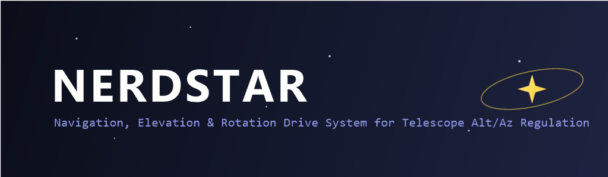

> *Because even the cosmos deserves a little nerd power.*

---

## 🚀 Was ist NERDSTAR?

NERDSTAR ist der Versuch, einen ESP32 dazu zu überreden,
dein Teleskop mit der Präzision eines NASA-Gyros und dem Charme eines Bastelkellers zu bewegen.

Zwei **TMC2209**-Treiber, ein **Joystick**, ein **OLED**, eine **RTC**
und ein Hauch Größenwahn ergeben zusammen ein
**RA/DEC-Steuerungssystem mit µs-Timing und Stil**.

> Kein KI-Overkill.
> Nur ehrlicher Schrittmotor-Schweiß und ein bisschen Mathematik.

---

## 🧬 Features

| Kategorie                     | Beschreibung                                                                 |
| ----------------------------- | ---------------------------------------------------------------------------- |
| 🔭 **Dual Axis Control**      | Zwei Achsen (RA & DEC) mit unabhängigen µs-Hardware-Timern                  |
| 🔹 **Joystick Navigation**    | Joystick für manuelles Slewen, Encoder für Menüs                            |
| 🧭 **Goto & Catalog**         | Objektbibliothek direkt aus dem EEPROM, Auswahl per Encoder, automatisches Goto |
| 💾 **EEPROM-Katalog**         | 200 vorkonfigurierte Sterne/Nebel/Galaxien/Planeten, beim Start automatisch geladen |
| 🕒 **RTC DS3231**             | Uhrzeit via Setup-Menü setzen, Grundlage für Planetenpositionen             |
| 🪐 **Planetenberechnung**     | Schlanker Algorithmus liefert aktuelle RA/Dec für klassische Planeten       |
| 🔧 **Setup & Kalibrierung**   | Menü für RTC-Zeit, Joystick-Zentrum, Achsenkalibrierung & EEPROM-Speicher   |
| 📺 **OLED Status Display**    | Zeigt RA/Dec, Tracking-/Goto-Status und gewähltes Ziel                      |
| ⚙️ **µs-Timersteuerung**      | Stepper laufen so gleichmäßig, dass man sie fast atmen hört                |
| 🧠 **ESP32 Dual-Core**        | Hauptrechner: Core 1 steuert die Motoren, Core 0 berechnet Kurs & Protokoll |
| 🔌 **Zwei ESP32**             | Zweiter ESP32-C3 kümmert sich ausschließlich um HID (Display, Joystick, Persistenz) |

---

## 💮 Projektziel (philosophisch betrachtet)

> „Wenn’s sich dreht und der Himmel nicht wegläuft, war’s ein Erfolg.“
> — *Philipp, 2025*

NERDSTAR ist modular aufgebaut:
Erst manuell bewegen, dann automatisch nachführen,
und irgendwann sagen: „Lauf, kleiner ESP, lauf mit den Sternen.“

---

## ⚙️ Hardwareübersicht

| Komponente             | Aufgabe                             | Pins / Anschlüsse                     |
| ---------------------- | ----------------------------------- | ------------------------------------- |
| **ESP32 (Hauptrechner)** | Kursberechnung + Motorsteuerung      | UART1 TX (33) ↔ HID-RX, UART1 RX (32) ↔ HID-TX |
| **ESP32-C3 (HID)**     | Display, Eingaben, EEPROM-Katalog    | UART1 TX (21) ↔ Main-RX, UART1 RX (20) ↔ Main-TX |
| **TMC2209 (RA)**       | Dreht um die Rektaszensions-Achse   | STEP 25, DIR 26, EN 27, UART TX/RX = 17/16 |
| **TMC2209 (DEC)**      | Dreht um die Deklinations-Achse     | STEP 13, DIR 12, EN 14, UART TX/RX = 5/4 |
| **OLED (SSD1306)**     | Zeigt alles an, außer Mitleid       | I²C: SDA 8, SCL 9 (HID-ESP32-C3)      |
| **RTC (DS3231)**       | Sagt dir, wann du’s verpasst hast   | I²C: SDA 8, SCL 9 (HID-ESP32-C3)      |
| **Joystick (KY-023)**  | Steuert alles intuitiv falsch herum | VRx 0, VRy 1, SW 6 (HID-ESP32-C3)     |
| **Rotary-Encoder**     | Menü & Bestätigungen                | A = 3, B = 4, Button = 5 (HID-ESP32-C3) |

### 🔌 Verkabelung im Detail

#### Hauptrechner-ESP32 → Motortreiber

| Signal                   | Pin am ESP32 (Main) | Anschluss am TMC2209 (RA) | Anschluss am TMC2209 (DEC) |
| ------------------------ | ------------------- | ------------------------- | -------------------------- |
| Enable                   | 27                  | EN                        | EN                         |
| Richtung (DIR)           | 26                  | DIR                       | –                          |
| Schritt (STEP)           | 25                  | STEP                      | –                          |
| Richtung (DIR)           | 12                  | –                         | DIR                        |
| Schritt (STEP)           | 13                  | –                         | STEP                       |
| Treiber-UART TX          | 17                  | PDN/UART                  | –                          |
| Treiber-UART RX          | 16                  | PDN/UART                  | –                          |
| Treiber-UART TX          | 5                   | –                         | PDN/UART                   |
| Treiber-UART RX          | 4                   | –                         | PDN/UART                   |
| Versorgung & Masse       | 5 V / GND           | VM / GND                  | VM / GND                   |

> Hinweis: Beide TMC2209 teilen sich die Versorgung, die UART-Leitungen sind getrennt. TX und RX bitte jeweils an den PDN/UART-Pin laut Modulbelegung anschließen.

#### HID-ESP32-C3 → Benutzerschnittstellen

| Gerät / Signal                  | Pin am ESP32 (HID) | Bemerkung |
| -------------------------------- | ------------------ | --------- |
| OLED + RTC SDA                   | 8                  | Gemeinsamer I²C-Bus |
| OLED + RTC SCL                   | 9                  | Gemeinsamer I²C-Bus |
| Rotary-Encoder A                 | 3                  | INPUT_PULLUP verwenden |
| Rotary-Encoder B                 | 4                  | INPUT_PULLUP verwenden |
| Rotary-Encoder Button            | 5                  | Mit INPUT_PULLUP betreiben |
| Joystick X (VRx)                 | 0                  | ADC, high impedance |
| Joystick Y (VRy)                 | 1                  | ADC |
| Joystick Button                  | 6                  | LOW-aktiv |
| Gemeinsame Versorgung für HID    | 3.3 V / GND        | Alle Sensoren/Bedienelemente |

#### Verbindung zwischen den beiden ESP32

- **TX ↔ RX kreuzen:** Main-TX (GPIO 33) → HID-RX (GPIO 20) und Main-RX (GPIO 32) ← HID-TX (GPIO 21)
- **GND verbinden:** Gemeinsamer Bezugspunkt für UART und Sensoren
- Optional: **5 V / 3.3 V** gemeinsam einspeisen, wenn beide Boards aus derselben Quelle versorgt werden
- USB bleibt frei: Beide Boards können weiterhin über ihren USB-Port debuggt bzw. mit Logausgaben versorgt werden.

Diese Belegung entspricht exakt den Konstanten in [`config.h`](config.h) und stellt sicher, dass jede Komponente am richtigen Controller hängt.

---

## 🧠 Softwarestruktur

```
NERDSTAR/
│
├── NERDSTAR.ino           # Orchestriert Setup/Loop
├── catalog.cpp/.h         # EEPROM-Katalog & Parser
├── display_menu.cpp/.h    # OLED-Menüs, Setup, Goto, Polar Align
├── input.cpp/.h           # Joystick + Encoder Handling
├── motion_main.cpp/.h     # Stepper-Steuerung & Kursberechnung (Hauptrechner)
├── motion_hid.cpp         # RPC-Proxy für Motion-Funktionen (HID)
├── comm.cpp/.h            # UART-Protokoll zwischen Hauptrechner und HID
├── planets.cpp/.h         # Schlanke Planeten-Ephemeriden
├── storage.cpp/.h         # EEPROM-Konfiguration & Katalogspeicher
├── config.h               # Pinout & Konstanten
├── data/catalog.xml       # Quellliste für den eingebauten Katalog
├── docs/
│   ├── BEDIENUNGSANLEITUNG.md # Schritt-für-Schritt-Bedienung
│   └── nerdstar-banner.png    # Für die Optik
├── LICENSE
└── README.md
```

---

### Firmware-Varianten

- **HID-Firmware (Standard)**: Ohne zusätzliche Defines kompilieren. Baut das
  UI für Display, Joystick, Katalog und spricht den Hauptrechner per UART an.
- **Hauptrechner-Firmware**: In den Compiler-Optionen `DEVICE_ROLE_MAIN`
  definieren (z.B. `-DDEVICE_ROLE_MAIN`). Der Code initialisiert die
  Schrittmotoren, startet zwei Tasks (Core 0 = Kursberechnung & Protokoll,
  Core 1 = Motorsteuerung) und beantwortet alle Motion-RPCs.

Beide Varianten verwenden nun **UART1** für die Verbindung: Beim Hauptrechner
laufen die Leitungen über **TX33/RX32**, die HID-Variante mit dem ESP32-C3
SuperMini nutzt **TX21/RX20**. Damit bleibt der jeweilige USB-Seriell-Port für
Debugging und Logausgaben frei.

---

## 📖 Dokumentation & Daten

- [Bedienungsanleitung](docs/BEDIENUNGSANLEITUNG.md) mit Schritt-für-Schritt-Anweisungen
- Beispiel-Datenbank: [`data/catalog.xml`](data/catalog.xml) – dient als Quelle für den eingebauten EEPROM-Katalog
- Alle Kalibrierungen & Zustände werden im EEPROM des ESP32 abgelegt

---

## 📺 OLED-Anzeige

```
NERDSTAR Status
RA: 05h 34m 31s
Dec: +22° 00' 52"
Align: Yes  Trk: On
Sel: Messier 042
Goto: --
```

> Wenn du das siehst, weißt du wohin das Teleskop blickt.
> Wenn nicht, hilft die [Bedienungsanleitung](docs/BEDIENUNGSANLEITUNG.md).

---

## 🛰️ Nachführung & Goto

- **Polar Alignment**: eigener Menüpunkt, speichert den Align-Status im EEPROM.
- **Tracking**: siderisches Tracking nach erfolgreicher Ausrichtung per Knopfdruck.
- **Goto**: Auswahl im Katalog, Start im Hauptmenü, Abbruch jederzeit über den Joystick.
- **Planeten**: aktuelle Positionen werden aus der RTC-Zeit berechnet – keine statischen Tabellen.

Kurz gesagt: Der ESP32 weiß, wohin es geht, und bleibt dank Tracking dort.

---

## 🧰 Abhängigkeiten

| Bibliothek         | Zweck                              | Empfohlene Version |
| ------------------ | ---------------------------------- | ------------------ |
| `TMCStepper`       | Kommunikation mit TMC2209          | ≥ 0.7.3            |
| `Adafruit_SSD1306` | OLED-Anzeige                       | ≥ 2.5.9            |
| `Adafruit_GFX`     | Grafik-Backend                     | ≥ 1.11.9           |
| `RTClib`           | DS3231 RTC                         | ≥ 2.1.3            |

---

## ⚡ Installation

1. Arduino IDE öffnen
2. Boards wählen:
   - HID-Controller: **ESP32C3 Dev Module** (ESP32-C3 SuperMini)
   - Hauptrechner: **ESP32 Dev Module**
3. Bibliotheken installieren (siehe oben)
4. **HID-ESP32-C3** flashen (ohne zusätzliche Build-Flags)
5. **Hauptrechner-ESP32** flashen (Build-Flag `-DDEVICE_ROLE_MAIN` setzen)
6. UART kreuzen: Main-TX33 ↔ HID-RX20, Main-RX32 ↔ HID-TX21, GND verbinden
7. Kaffee holen
8. Freuen, dass du was gebaut hast, das klingt wie ein NASA-Projekt und aussieht wie ein Nerd-Traum.

---

## 📸 Fun Fact

> „Warum NERDSTAR?“
> – Weil *‘Alt/Az-Mount Controller with Dual-Axis Timer Sync and Real-Time RTC Support’*
> nicht gut auf ein T-Shirt passt.

---

## 💩 Lizenz

GNU General Public License v3.0 © 2025 Philipp

> Benutze, forke, modifiziere – aber denk dran:
> Auch im Weltall gilt: Kein Support bei falscher Polausrichtung.

---

## ✨ Schlusswort

**NERDSTAR** –
Ein Projekt für Menschen, die beim Wort *Stepper*
nicht an Aerobic, sondern an Himmelsmechanik denken.

🤓🌠 *Stay nerdy, track steadily.*
